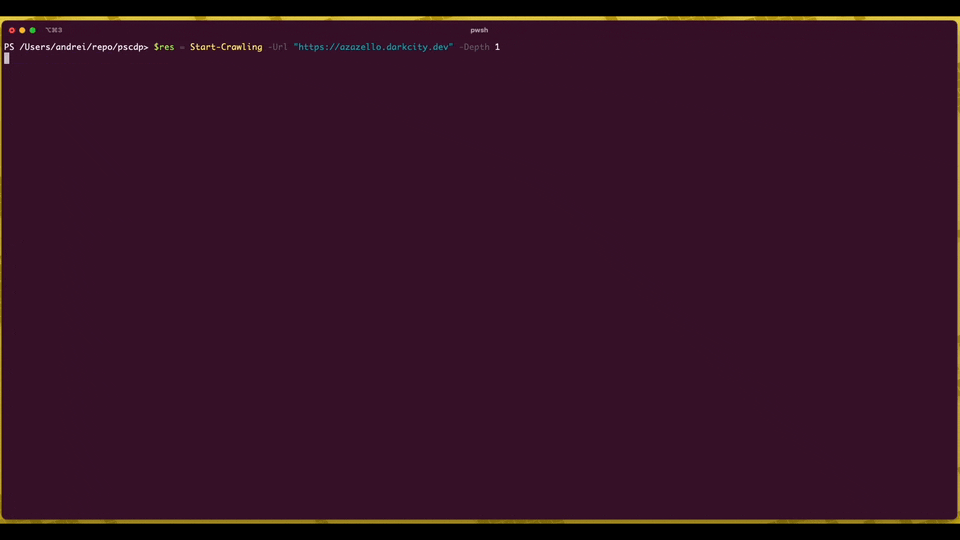

# Overview

Quick and dirty PowerShell module which:

- uses chromium to crawl a web page, via [CDP](https://chromedevtools.github.io/devtools-protocol/) protocol
- subscribe to and capture some events browser issues as it processes a page
- returns events captured
- returns a graph, containig a map of a web site

Uses [BaristaLabs generator](https://github.com/eosfor/chrome-dev-tools-generator)

## Usage

```pwsh
$res = Start-Crawling -Url "https://azazello.darkcity.dev" -Depth 1
```

## Demo

The demo shows how all this works together with [PSQuickGraph](https://www.powershellgallery.com/packages/PSQuickGraph/2.1.2) module

